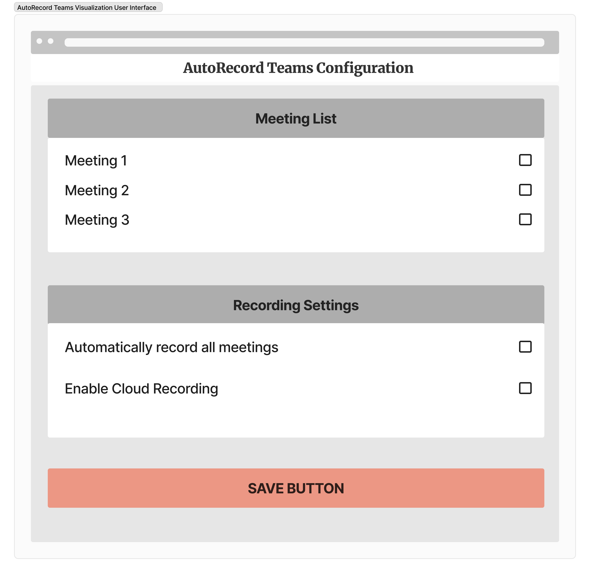

# AutoRecord Teams

In response to the growing demand for streamlined meeting management within Microsoft Teams, AutoRecord Teams aims to provide a seamless solution for configuring and automating the recording of specific Teams Meetings. This application, designed to be deployed within a client's Microsoft 365 tenant, offers a user-friendly interface, deep integration with Microsoft Graph API, and adherence to Microsoft security standards.

## Features

- User-friendly interface within Microsoft Teams to configure meeting recording settings
- Integration with Microsoft Graph API to fetch all meetings within the client's tenant
- Programmatically enable automatic recording settings for all meetings in the client's tenant using the Teams API
- Resource-efficient and scalable deployment within the client's Microsoft 365 environment

## Installation

1. Clone this repository: `git clone https://github.com/JeonJiw/AutoRecordTeams.git`
2. Install dependencies using npm: `npm install`
3. Set up your Azure AD client ID and authority in the code (replace 'YOUR_CLIENT_ID' and 'YOUR_TENANT_ID' in `teams-autorecord.js`)

## Usage

To run the application:

1. Open a terminal and navigate to the project directory.
2. Execute the command: `node teams-autorecord.js`

## Contributing

Contributions are welcome! Please follow the [CONTRIBUTING.md](CONTRIBUTING.md) guidelines.

## License

This project is licensed under the [MIT License](LICENSE).

## Contact

For any inquiries or feedback, please contact the project maintainer:

- [Vergil Phan](mailto:v.phan545@mybvc.ca)
- [Jiwon Jeon](mailto:jiwon@example.com)
- [Chris Thibodeau](mailto:chris@example.com)
- [Jhenyffer Cristo Marques](mailto:jhenyffer@example.com)

